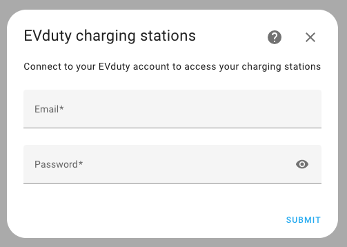
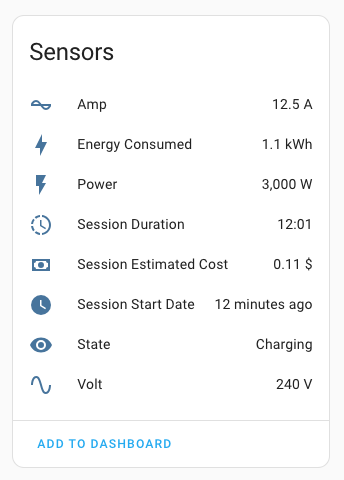

[](https://github.com/happydev-ca/evduty-home-assistant/actions/workflows/test.yml)
[](https://github.com/happydev-ca/evduty-home-assistant/actions/workflows/validate.yml)

# EVduty Custom Integration for Home Assistant

Use to monitor your EVduty charging stations including charging session state, estimated cost and energy consumption.

## Installation

### Automatic

[](https://my.home-assistant.io/redirect/hacs_repository/?owner=happydev-ca&repository=evduty-home-assistant&category=integration)

Or:

- Go to your Home Assistant
- Open HACS
- Search for `EVduty`
- Click the `Download` button on the bottom right
- Restart Home Assistant

### Manual

- Copy the `evduty` folder your `/path/to/home-assistant/custom_components/` directory
- Restart Home Assistant

## Configuration

- Go to `Settings` -> `Devices & Services`
- Click on the `Integrations` tab
- Click the `Add Integration` button
- Search for EVduty



Then click the `Submit` button. Your credentials will be validated, and your charging stations will be created in Home Assistant.

*This custom integration does not support configuration through the `configuration.yaml` file.*

## Sensors

A device is created for each charging station in your account. The following sensors are created for each charging station:



## Development

### Test locally

```shell
make install
make test
```

### Run locally

```shell
# from ha core repo, setup ha core
script/setup
source venv/bin/activate

# create a symlink in config folder to this folder
ln -s ../evduty-home-assistant/custom_components config/custom_components

# run
hass -c config
```

### Release version

```shell
make release bump=patch|minor|major
```